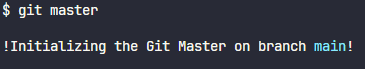

<div align="center">
 <h1>
<br/>
  
<br/>
<br/>
Git Master Plugin
</h1>
<p>The essential tool to boost your Git Workflow</p>


</div>

## About

Are you looking for ways to simplify your Git operations and optimize your workflow? The `git-master-plugin` is designed to make your life easier by offering new features and automating repetitive tasks. With it, you can:

- Improve efficiency when managing branches and merge conflicts;
- Automate routine tasks;
- Customize your Git operations according to your specific needs.

Whether you're a solo developer or part of a collaborative team, `git-master-plugin` helps ensure a smoother, more organized and productive workflow.

Install it now and discover how this tool can take your Git experience to a whole new level!

## Setup

### Requirements

- [Git](https://git-scm.com/)

### Download

First, clone the project in your command line:

```bash
# Clone this repository
$ git clone https://github.com/ailtonloures/git-master-plugin.git
```

#### Or manual download

[Go to latest](https://github.com/ailtonloures/git-master-plugin/archive/refs/heads/main.zip)

### Initializing

Then run the `init.sh` script to initialize the plugin configuration:

```bash
# Go into the repository
$ cd git-master-plugin

# Run the `init.sh` script
$ ./init.sh
```

## How to use

Open a project of yours that is being versioned with `git` and in your terminal run the command `git master`.

```bash
# Run the git master command
$ git master
```

### Example



### Steps

1. Choose a branch to merge with the current branch;
   1. You can select a new branch after the merge process of the previously selected branch.
2. Confirm that git should push;
3. Confirm that git should create a new tag;
4. Confirm that git should remove the local branches;
5. Finally, the process will end automatically;

## Contributing

Contributions are always welcome, consider opening an issue first and discuss with the community before opening a pull request.

Check out the [CONTRIBUTING.md](./CONTRIBUTING.md).
